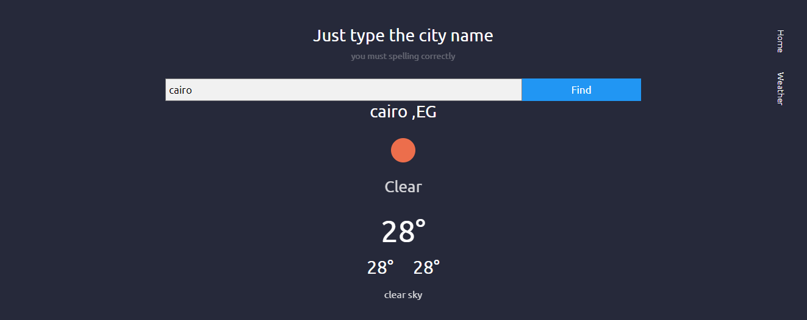

> # Weather 
> # Home page #
>>  
>> - Weather forecasting implementation ( by location ) using API : ( https://documenter.getpostman.com/view/4805376/RznEKJSb?version=latest ).
>> - Using location tracking automatically to track the user country and display weather using this result.
>> - Using React js. 
> ## Header ##
>> - Navigate bar (Home , Weather ).
> ## Main #
>> - Detect user'city using API (https://ipapi.co/json/) and display temperature & weather description .
>> - Find current weather for the correct country user type.
> ## Note ##
>> - To run try to install npm and disable adblock.